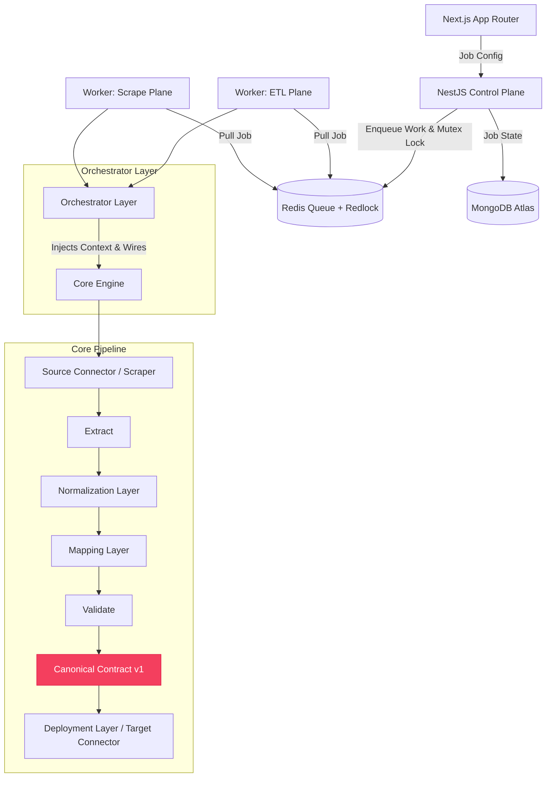

# Commerce Data Orchestrator

## Project Overview
The Commerce Data Orchestrator is a robust, multi-tenant SaaS integration bus designed to extract, normalize, and load high-volume e-commerce data across different platforms (commercetools, Shopify, BigCommerce) and origins (web scraping, file uploads).

## System Purpose
To provide a highly scalable, idempotent, and intelligent data migration and synchronization pipeline that eliminates manual data mapping and platform-specific tight coupling.

## High-Level Architecture Summary
The system operates on an ETL (Extract, Transform, Load) paradigm built around a **Universal Canonical Contract**. 
- **Ingestion**: Scrapes websites, consumes files, or pulls from APIs.
- **Mapping**: Transforms proprietary payloads into decoupled Canonical Models.
- **Execution**: A Core Engine orchestrates the pipeline using memory-safe async generators.
- **Deployment**: Load balanced, rate-limited Target Connectors upsert Canonical Models into destination platforms.



*Note: Distributed locking via Redis is strictly enforced to prevent concurrent destructive operations on target APIs.*

## Job Types Overview
- `SCRAPE_IMPORT`: Public HTML → Raw JSON → Canonical → Target Platform
- `CROSS_PLATFORM_MIGRATION`: Source Platform → Canonical → Target Platform
- `PLATFORM_CLONE`: Source Platform → Phase 1: Schema Replication → Phase 2: Entity Replication → Target Platform
- `EXPORT`: Platform → Canonical → CSV/JSONL

## Multi-Tenancy Strategy
All architectural layers enforce data isolation natively.
- **Database**: Mongoose schemas require `tenantId`. Repositories perform strict scoping.
- **Execution**: Each worker instance retrieves only the credentials for the tenant executing the job. Workers are stateless and horizontally scalable.
- **Encryption**: API keys are AES-256-GCM encrypted and only decrypted at the edge inside the worker's execution memory.
- **Locking**: Redis-based distributed Redlocks prohibit concurrent destructive operations against the same target environment for a single tenant.
- **Isolation**: Per-job correlation IDs and trace IDs guarantee absolute execution isolation and observable log trailing.

## Dependency Rules
Dependencies must flow **inwards** toward the core.
- `apps/` depend on `packages/`
- `packages/connectors`, `packages/mapping`, `packages/ingestion` depend on `packages/core` and `packages/shared`
- `packages/core` depends **ONLY** on `packages/shared`
- `packages/shared` depends on nothing.

## Monorepo Structure
```text
commerce-orchestrator/
├── apps/
│   ├── web/                     # Next.js App Router
│   ├── api/                     # NestJS (Control Plane)
│   ├── worker-etl/              # NestJS (Data Plane)
│   └── worker-scrape/           # NestJS (Scraping Plane)
└── packages/
    ├── core/                    # Pure TS ETL Pipeline
    ├── shared/                  # Canonical Contracts & Zod Schemas
    ├── connectors/              # Platform SDK implementations
    ├── ingestion/               # Puppeteer/Playwright Clusters
    ├── mapping/                 # Heuristic & AI Mapping Engine
    ├── db/                      # Tenant-aware Mongoose DAO
    ├── queue/                   # BullMQ Job Producers
    └── auth/                    # RBAC & Middlewares
```

## Developer Rules
1. **No Global State**: Everything is scoped per job. Caching happens in Redis.
2. **No Env Leakage**: Core modules rely on explicit Injection, never `process.env`.
3. **No Domain Leakage**: NestJS Controllers do not possess mapping rules.
4. **Idempotency**: Connectors upsert, they do not blindly create.

## Documentation Index
- [System Overview](docs/architecture/system-overview.md)
- [Orchestrator Design](docs/architecture/orchestrator.md)
- [Dependency Graph](docs/architecture/dependency-graph.md)
- [Job Topologies](docs/architecture/job-topologies.md)
- [Ingestion Layer](docs/architecture/ingestion-layer.md)
- [Mapping Layer](docs/architecture/mapping-layer.md)
- [Deployment Layer](docs/architecture/deployment-layer.md)
- [Canonical Models](docs/data-models/canonical-models.md)
- [Versioning Strategy](docs/data-models/versioning-strategy.md)
- [Error Taxonomy](docs/operations/error-taxonomy.md)
- [Locking Strategy](docs/operations/locking-strategy.md)
- [Observability](docs/operations/observability.md)
- [Retry Strategy](docs/operations/retry-strategy.md)
- [Getting Started](docs/onboarding/getting-started.md)
- [Local Development](docs/onboarding/local-development.md)
- [Contribution Guide](docs/onboarding/contribution-guide.md)
