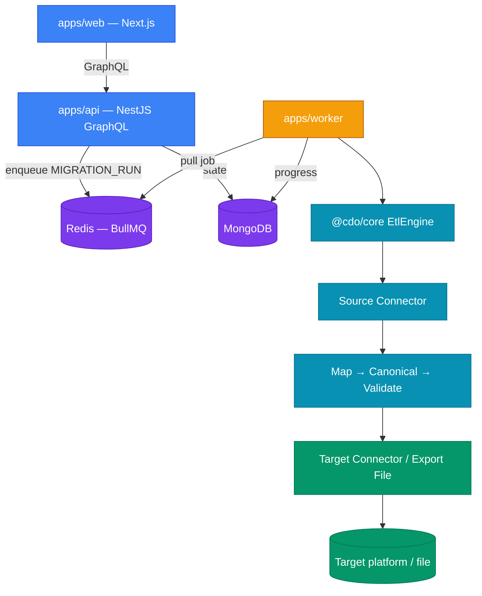

# Commerce Data Orchestrator

## What it is

A hosted tool for moving commerce catalog data between platforms.

An organization signs up, adds encrypted **connections** to their commerce
platforms (Shopify, commercetools, BigCommerce), then creates **migration
projects** that either:

- **migrate** categories / products / customers / orders into another platform, or
- **export** them to a CSV or JSON file for download.

Each project is executed as a **run** — as a dry run (validate only) or for real —
with per-entity progress and a list of any items that failed.

> The codebase is mid-simplification. See
> [docs/architecture/migration-scope.md](docs/architecture/migration-scope.md) for the
> product boundary and
> [docs/implementation-plans/00-simplification-plan.md](docs/implementation-plans/00-simplification-plan.md)
> for what is being removed. Older design docs live in `docs/archive/`.

---

## Architecture

ETL around a **Universal Canonical Contract**: extract from the source → map to
canonical → Zod-validate → upsert into the target (or append to an export file).


```mermaid
flowchart TD
    classDef client fill:#3b82f6,stroke:#1d4ed8,color:#fff
    classDef infra fill:#7c3aed,stroke:#5b21b6,color:#fff
    classDef worker fill:#f59e0b,stroke:#b45309,color:#fff
    classDef pipeline fill:#0891b2,stroke:#0e7490,color:#fff
    classDef target fill:#059669,stroke:#047857,color:#fff

    UI["apps/web — Next.js"]:::client
    API["apps/api — NestJS GraphQL"]:::client
    Redis[("Redis — BullMQ")]:::infra
    Mongo[("MongoDB")]:::infra
    Worker["apps/worker"]:::worker
    Engine["@cdo/core EtlEngine"]:::pipeline
    Src["Source Connector"]:::pipeline
    Map["Map → Canonical → Validate"]:::pipeline
    Tgt["Target Connector / Export File"]:::target
    Store[("Target platform / file")]:::target

    UI -->|GraphQL| API
    API -->|enqueue MIGRATION_RUN| Redis
    API -->|state| Mongo
    Worker -->|pull job| Redis
    Worker --> Engine
    Engine --> Src --> Map --> Tgt --> Store
    Worker -->|progress| Mongo
```

## Run mode

One job kind: `MIGRATION_RUN`, with `mode` = `MIGRATE` (→ target connection) or
`EXPORT` (→ CSV/JSON file). See
[docs/architecture/run-lifecycle.md](docs/architecture/run-lifecycle.md).

## Org scoping

- **Database**: every schema (except `organizations`/`users`) carries `tenantId` (the org id); repositories scope by it.
- **Users**: a `users` collection; each user belongs to one org with a `role` (`OWNER`/`MEMBER`).
- **Encryption**: connection credentials are AES-256-GCM encrypted, decrypted only in worker memory.
- **Concurrency**: a project with a `RUNNING` run rejects a second run (single worker; no Redlock).

## Dependency rules

Dependencies flow **inwards**.
- `apps/` depend on `packages/`
- `@cdo/connectors` depends on `@cdo/core` and `@cdo/shared`
- `@cdo/core` depends **only** on `@cdo/shared`
- `@cdo/shared` depends on nothing
- `apps/api` never imports `@cdo/core` or `@cdo/connectors`

## Monorepo structure (target)

```text
commerce-orchestrator/
├── apps/
│   ├── web/       # Next.js App Router dashboard
│   ├── api/       # NestJS GraphQL control plane
│   └── worker/    # NestJS BullMQ run executor
└── packages/
    ├── shared/      # Canonical contract & Zod schemas
    ├── core/        # Pure-TS pipeline engine
    ├── connectors/  # Platform adapters + mappers + file export
    ├── db/          # Org-scoped Mongoose repositories
    ├── queue/       # BullMQ producer + Redis config
    ├── auth/        # JWT strategy & guards
    ├── ui/          # shadcn/ui components
    └── gql/         # Apollo client + codegen hooks
```

## Developer rules

1. Everything is scoped per run. No global mutable state.
2. `packages/` never read `process.env` — config is injected. Only `apps/` read env.
3. NestJS resolvers hold no mapping logic.
4. Connectors upsert; they never blindly create.

## Documentation

Start at [docs/README.md](docs/README.md).
