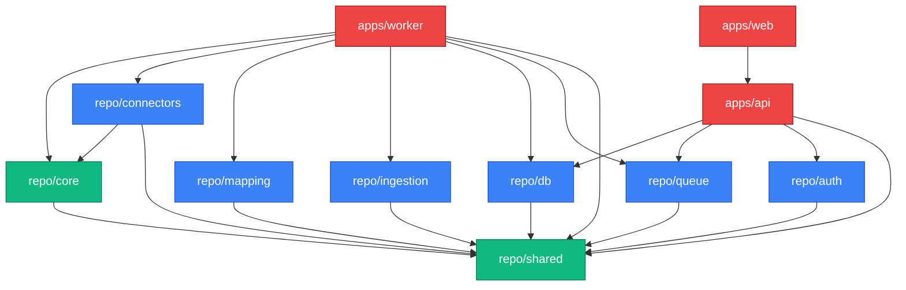

# Dependency Graph & Boundaries

To prevent architecture erosion, the monorepo strictly enforces dependency boundaries between packages. Violating these lines will result in circular dependencies.

## Architecture Layers

## The Rules
1. **Level 0 (`@repo/shared`)**: The absolute center. Depends on nothing. Provides Enums and Zod schemas out to the entire monorepo.
2. **Level 1 (`@repo/core`)**: Depends only on `shared`. Implements the pure TypeScript pipeline operations. Must NEVER import `nestjs`, `mongoose`, or `bullmq`.
3. **Level 2 (`@repo/mapping`)**: Depends only on `shared`. Takes raw objects, outputs Canonical interfaces.
4. **Level 3 (`@repo/connectors`)**: Depends on `core` (for Interfaces) and `shared` (for data structures). Speaks to APIs. Must NEVER import `db`.
5. **Level 4 (`@repo/db`)**: Depends on `shared`. Wraps `mongoose` and `nestjs`. Only imports definitions, never execution logic.
6. **Level 5 (`apps/api`)**: Depends on `db`, `queue`, `auth`, `shared`. NEVER imports `core` or `connectors`.
7. **Level 6 (`apps/worker`)**: The host. Depends on EVERYTHING to wire the systems together securely.
