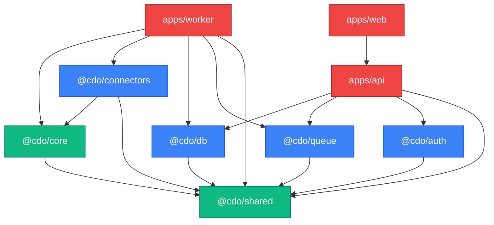

# Dependency Graph & Boundaries

Package dependencies flow one way. Violations create cycles and let framework code leak into pure layers.

```mermaid
graph TD
    classDef app fill:#ef4444,stroke:#991b1b,color:#fff
    classDef pkg fill:#3b82f6,stroke:#1d4ed8,color:#fff
    classDef core fill:#10b981,stroke:#047857,color:#fff

    Web["apps/web"]:::app
    API["apps/api"]:::app
    Worker["apps/worker"]:::app

    Core["@cdo/core"]:::core
    Shared["@cdo/shared"]:::core

    Conn["@cdo/connectors"]:::pkg
    DB["@cdo/db"]:::pkg
    Queue["@cdo/queue"]:::pkg
    Auth["@cdo/auth"]:::pkg

    Web --> API
    API --> DB
    API --> Queue
    API --> Auth
    API --> Shared
    Worker --> Core
    Worker --> Conn
    Worker --> DB
    Worker --> Queue
    Worker --> Shared

    Conn --> Core
    Conn --> Shared
    Core --> Shared
    DB --> Shared
    Queue --> Shared
    Auth --> Shared
```

## Rules

1. **`@cdo/shared`** — the center. Depends on nothing. Enums, canonical types, Zod validators, constants.
2. **`@cdo/core`** — depends only on `shared`. Pure pipeline mechanics (`EtlEngine`, retry). MUST NEVER import `nestjs`, `mongoose`, or `bullmq`.
3. **`@cdo/connectors`** — depends on `core` (interfaces) and `shared` (types). Speaks to platform APIs; also holds canonical mappers/normalizers and the file-export target. MUST NEVER import `db`.
4. **`@cdo/db`** — depends on `shared`. Wraps `mongoose` + NestJS. Schemas + org-scoped repositories only.
5. **`@cdo/queue`** — depends on `shared`. BullMQ producer + Redis connection config.
6. **`@cdo/auth`** — depends on `shared`. JWT strategy, guard, `@CurrentOrg()`.
7. **`apps/api`** — depends on `db`, `queue`, `auth`, `shared`. NEVER imports `core` or `connectors`.
8. **`apps/worker`** — the host. Wires everything: pulls jobs, decrypts credentials, builds connectors, drives `@cdo/core`.
9. **`apps/web`** — talks to `apps/api` over GraphQL. Uses `@cdo/ui`, `@cdo/gql`.

## Removed from the old graph

`@cdo/mapping` (merged into `@cdo/connectors`), `@cdo/ingestion` (deleted), `@cdo/redis` (merged into `@cdo/queue`), `apps/worker-scrape` (deleted). `apps/worker-etl` is now `apps/worker`.
