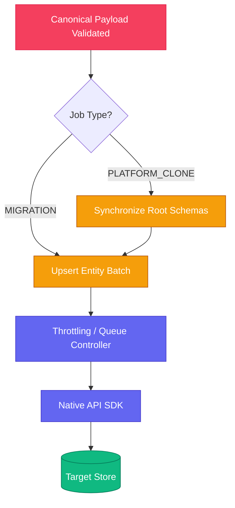

# Deployment Layer

The Deployment Layer (`@cdo/connectors/target`) handles the mutation of data against target platforms.

## Core Philosophy: Idempotency & Upserts
Target Connectors almost never blindly execute a "Create Mutation". 
ETL jobs can and will fail mid-flight due to network issues. If a job crashes at record `50,000` out of `100,000`, the job is restarted. The first `50,000` records *must not be duplicated*.
- Connectors enforce **Upsert Strategies**.
- e.g. commercetools relies on `import-api` which handles upsert merging gracefully.

## Capability Detection & Project Cloning
Some workflows (like `PLATFORM_CLONE`) require exactly replicating structural environments.
Target connectors emit their `getCapabilities()`.
- If cloning, the orchestrator tells the Source to `extractSchema()`, and passes it to the Target `deploySchema()`.
- E.g. Target commercetools connector queries if `TaxCategory` exists. If not, it creates it *before* attempting to inject products.

## Deployment Separation Diagram

