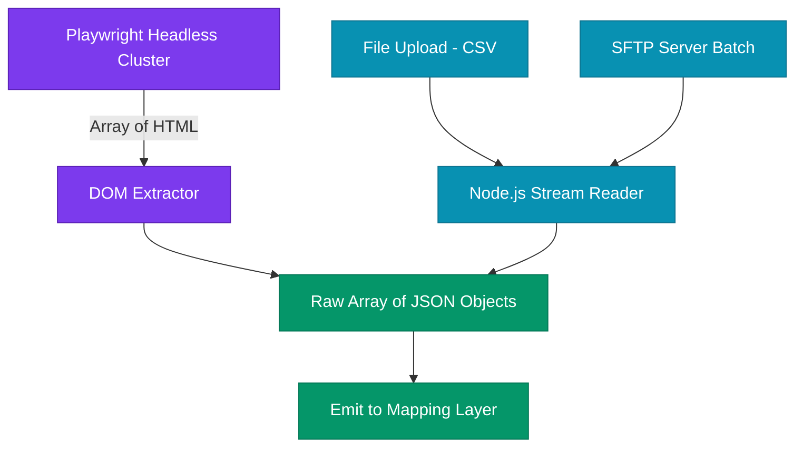

# Ingestion Layer

The Ingestion layer (`@repo/ingestion`) handles the acquisition of raw data out of external, proprietary environments and file streams. 

## Separation of Concerns
This layer is **completely isolated** from platform API connectors (`@repo/connectors`). The ingestion layer has no SDKs for Shopify or commercetools; it focuses purely on parsing raw DOM elements and CSV/JSON bytes.

## Components
1. **Platform Source Connectors (API-Based)**: While APIs typically sit in `@repo/connectors`, some raw proprietary extractions (e.g. FTP syncs) drop data directly into the ingestion funnel.
2. **Website Scraper Engine (Playwright/Puppeteer)**: Highly CPU/Memory bound cluster operations that utilize Stealth plugins to extract HTML structures from target domains.
3. **HTML Parser / DOM Extractor**: Selectors that convert `div` and `span` blocks into flat JSON arrays.
4. **File Streamer (CSV/JSON)**: `stream.pipeline` implementation chunking large user-uploaded CSV files.

## Ingestion Flow Diagram

