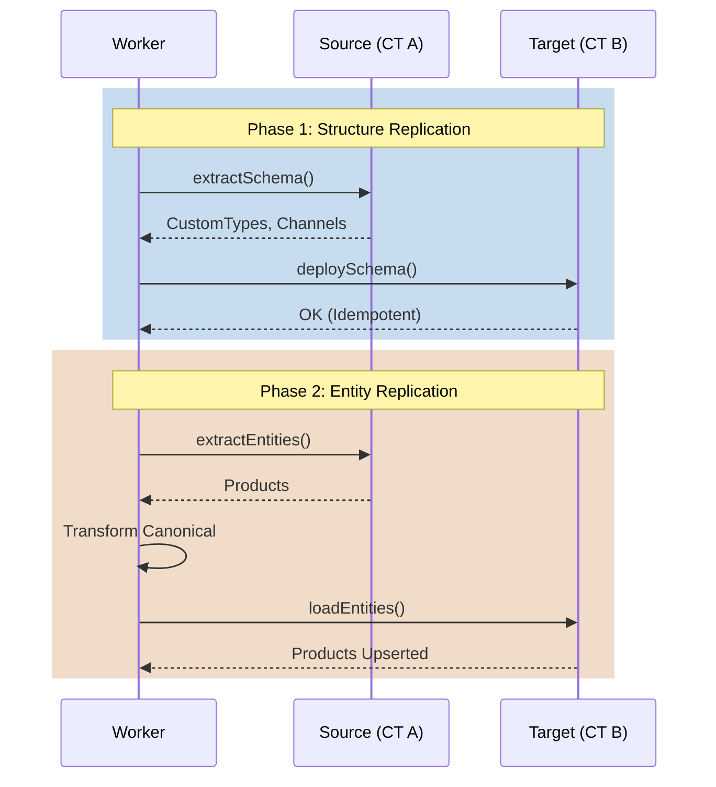

# Job Topologies

The system supports polymorphic workloads routed to different worker pools based on their compute profile.

## Topology Pipeline Flows

### 1. `SCRAPE_IMPORT`
Public HTML $\rightarrow$ Raw JSON $\rightarrow$ Normalize $\rightarrow$ Canonical Model $\rightarrow$ Target Platform.

```mermaid
flowchart LR
    TargetWeb((Website)) -->|Playwright| Ingestion[@repo/ingestion]
    Ingestion -->|Raw Output| Norm[Normalization Layer]
    Norm -->|Clean JSON| Mapping[@repo/mapping]
    Mapping -->|Canonical Object| Core[@repo/core]
    Core -->|Load()| Target[@repo/connectors]
    Target --> Store[(Target Store)]
```

### 2. `CROSS_PLATFORM_MIGRATION`
Source Platform $\rightarrow$ Canonical Model $\rightarrow$ Target Platform.

```mermaid
flowchart LR
    StoreA[(CommerceTools)] -->|Extract()| Source[@repo/connectors]
    Source -->|Raw SDK Object| Mapping[@repo/mapping]
    Mapping -->|Canonical Object| Core[@repo/core]
    Core -->|Load()| Target[@repo/connectors]
    Target -->|SDK Upsert| StoreB[(Shopify)]
```

### 3. `PLATFORM_CLONE`
Replicates structural schema and data concurrently in a strict two-phase process.
* **Phase 1**: Structure Replication (Types, Channels, Taxes).
* **Phase 2**: Entity Replication (Products, Customers).



### 4. `EXPORT`
Platform $\rightarrow$ Canonical Model $\rightarrow$ CSV/JSONL.

```mermaid
flowchart LR
    StoreA[(BigCommerce)] -->|Extract| Source[@repo/connectors]
    Source --> Mapping[@repo/mapping]
    Mapping --> Core[@repo/core]
    Core -->|Load()| FileOutput[@repo/ingestion/file-builder]
    FileOutput --> S3[(AWS S3 / Zip)]
```
