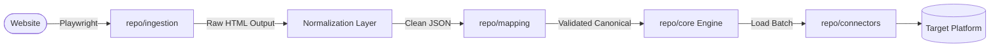
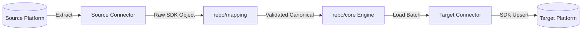
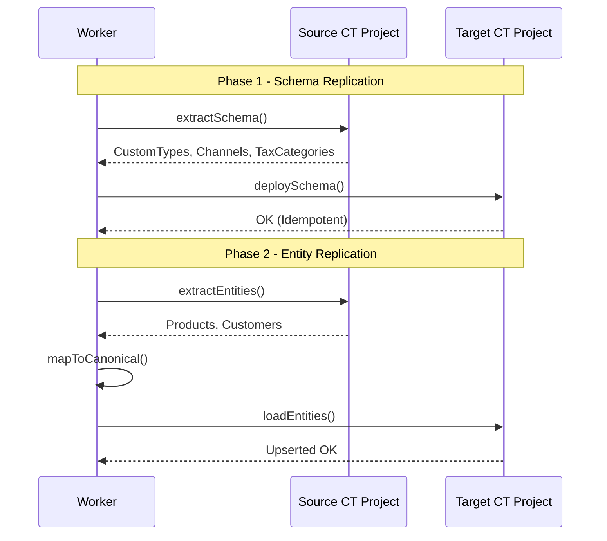
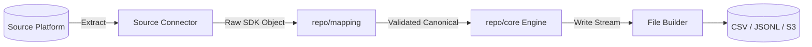

# Job Topologies

The system supports polymorphic workloads routed to different worker pools based on their compute profile.

## Topology Pipeline Flows

### 1. `SCRAPE_IMPORT`
Public HTML → Raw JSON → Normalize → Canonical Model → Target Platform.

### 2. `CROSS_PLATFORM_MIGRATION`
Source Platform → Canonical Model → Target Platform.

### 3. `PLATFORM_CLONE`
Strict **two-phase** replication process.
- **Phase 1**: Schema replication (Types, Channels, Tax Categories).
- **Phase 2**: Entity replication (Products, Customers, Orders).

### 4. `EXPORT`
Platform → Canonical Model → CSV/JSONL file output.

