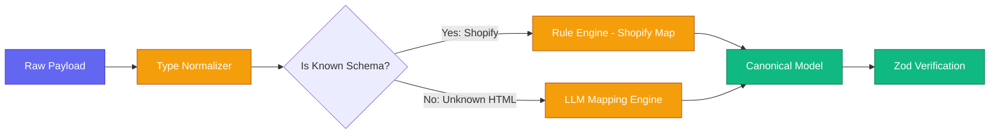

# Mapping & Normalization Layer

The Mapping layer (`@cdo/mapping`) acts as the translative bridge. It receives raw arrays of data from the Ingestion Layer or Source Connectors and forces them into strict, typified Canonical Models.

## Core Rules
**The user does not explicitly map fields**. 
Unlike generic automation tools (Zapier/Make) where a human clicks and drags `Product.title` $\rightarrow$ `name.en`, this platform uses internal heuristics, rules, and AI to automate schema reconciliation.

## Subsystems

1. **Raw Data Normalizer**: Cleans data types. Converts `"1,200.50"` into `{ amount: 120050, currency: "USD" }`. Formats ISO 8601 timestamps.
2. **Rule-Based Mapping Engine**: Heuristics for known transitions (e.g. Shopify payload shape $\rightarrow$ Canonical shape).
3. **AI-Assisted Mapping**: Optional fallback. When scraping an unmapped website, passes the raw JSON tree to an LLM explicitly prompted to return a `CanonicalProduct` schema.

## Mapping Flow Diagram

