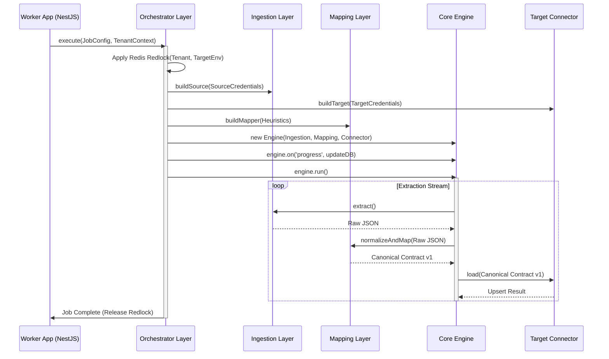

# Orchestrator Layer

The Orchestrator resides within the Worker Apps (`apps/worker-etl`, etc.) but delegates actual logic to the `@repo/core` ETL Engine.

## Orchestrator Responsibilities
1. **Decoupling**: Provides runtime instances of connectors and mappers to the Core Engine.
2. **Setup Phase**: Decrypts credentials from the database and initializes Target and Source connectors.
3. **Execution**: Starts the ETL stream securely.
4. **State Management**: Subscribes to events emitted from the Core Engine (`onSuccess`, `onFailure`) and persists them synchronously to atomic MongoDB updates or Redis progress updates.

## Why The Worker Must Not Directly Wire Dependencies
The NestJS worker's sole responsibility is **host infrastructure binding** (e.g., getting a job from Redis, keeping track of memory limits, shutting down gracefully). 

If the Worker directly imports `packages/mapping` or `packages/connectors`, we suffer from:
1. **Tight Coupling**: We lose the ability to deploy the Core Engine independently or migrate to serverless execution environments in the future cleanly.
2. **Framework Leakage**: NestJS concepts (like Dependency Injection Tokens) would bleed into the pure TypeScript mapping and pipeline layers.
3. **Bloated Scope**: The Worker would need to know how to set up Playwright clusters for Scrapes *and* GraphQL clients for Migrations simultaneously.

The Orchestrator abstracts this. It builds the precise pipeline context for that *specific job type*, and executes it.

**Crucially, the Orchestrator injects the following into the Core Environment:**
- `tenantId` (for safe state resolution)
- `correlationId` (for observability tracing)
- `locking token` (Redlock persistence marker)
- `jobType strategy` (e.g. Scrape vs Migration instructions)

## Orchestrator Flow Diagram


## Example Structure

```typescript
export class DataEtlOrchestrator {
    constructor(private readonly jobRepo: JobRepository) {}

    async executeEtlJob(job: JobDefinition) {
        // Instantiate Connectors via Factory pattern
        const source = ConnectorFactory.createSource(job.sourceConfig);
        const target = ConnectorFactory.createTarget(job.targetConfig);
        
        // Let the Core Engine handle mapping and streams
        const engine = new EtlEngine(source, target);
        
        // Listeners persist state
        engine.on('itemFailed', (err) => this.pushToDLQ(job.id, err));
        engine.on('batchCompleted', (metrics) => this.updateJobState(job.id, metrics));

        await engine.run();
    }
}
```
