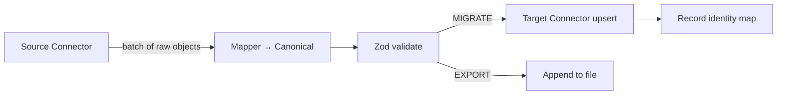
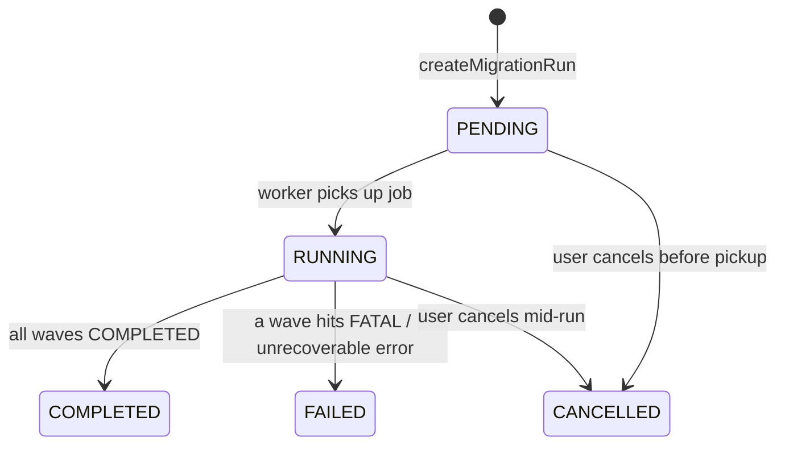

# Run Lifecycle

There is **one** kind of job: `MIGRATION_RUN`. It executes a `MigrationProject` in one of two modes. This replaces the earlier four-topology model (`SCRAPE_IMPORT`, `CROSS_PLATFORM_MIGRATION`, `PLATFORM_CLONE`, `EXPORT`).

## Modes

| Mode | Source | Destination | Notes |
|---|---|---|---|
| `MIGRATE` | source connection | target connection (upsert) | `identity_maps` records new target ids |
| `EXPORT` | source connection | CSV / JSON file | one file, downloadable when the run completes |

`dryRun` applies to both modes: everything runs except the final write.

## Pipeline (per entity type)



- **Batch size** 50. On a batch failure, fall back to item-by-item so one bad record does not sink the batch.
- **Errors** (`@cdo/shared` `ErrorType`):
  - `VALIDATION` — bad data. Skip the item, append to `migration_runs.failedItems[]`, continue.
  - `TRANSIENT` — network / rate limit. Retry with exponential backoff (bounded). If still failing, treat as failed item.
  - `FATAL` — misconfiguration (bad credentials, unsupported entity). Stop the wave, mark the run `FAILED`.
- No circuit breaker. No DLQ collection.

## Order of execution

Waves run in a fixed dependency order, filtered to the entity types the project selected:

```
CATEGORIES → PRODUCTS → CUSTOMERS → ORDERS
```

This is a constant list, not a computed topological sort. Products resolve their category references through `identity_maps`; orders resolve customer and product references the same way.

## State transitions



Per-wave: `PENDING → RUNNING → COMPLETED | FAILED`, or `SKIPPED` if the entity type has no data.

## Who does what

- **API** (`createMigrationRun`): validate project + connection ownership, create the run with wave stubs, enqueue the BullMQ job (jobId = runId, so duplicate enqueues dedupe).
- **Worker orchestrator**: decrypt credentials, build source/target connectors via `ConnectorFactory`, run each wave through `@cdo/core`'s `EtlEngine`, persist progress via repository calls, finalize the run.
- **`@cdo/core`**: pure pipeline mechanics — no database, no queue, no framework. Emits `progress` / `itemFailed` / `waveCompleted` events the orchestrator subscribes to.

## Resume

A new run can be started with `resumeFromRunId`. The API copies each wave's `cursor` from the referenced run into the new run's wave stubs; extraction restarts from those positions. The referenced run is never modified.

## Concurrency

A project with a `RUNNING` run rejects a second run (`409`). With a single worker this is sufficient; Redlock is not used. If the deployment ever scales to multiple workers, add a lock keyed by `targetConnectionId` at that point — not before.
