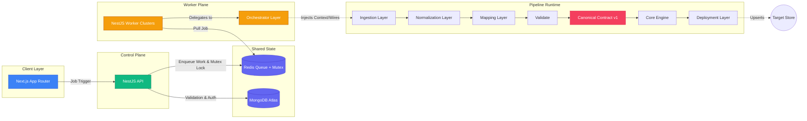

# System Overview

## Purpose
The Commerce Data Orchestration Platform is a multi-tenant SaaS integration bus designed to extract, normalize, and load high-volume e-commerce data across different platforms (commercetools, Shopify, BigCommerce) and origins (web scraping, file uploads).

## The Core Concept: The Universal Canonical Contract
The system operates on an ETL (Extract, Transform, Load) paradigm built around a **Universal Canonical Contract**. Connectors (the spokes) do not communicate directly with each other. They only speak the "Canonical Language" (the hub).
* An Input Spoke (API Source, or Scraper) transforms its proprietary format into a `CanonicalProduct`.
* An Output Spoke (Target API) takes a `CanonicalProduct` and transforms it into its proprietary mutation payload.

## Architecture

## Layer Separation
- **Client Layer**: Pure presentation. React Server components securely fetch state.
- **Control Plane**: Stateless, synchronous. Ensures `tenantId` is applied and valid. Encrypts credentials.
- **Worker Plane**: Heavy computation. Stateless and horizontally scalable. Runs core pipelines.
- **Orchestrator Layer**: Wires disparate systems together securely.
- **Pipeline Runtime**: Holds Ingestion, Mapping, deployment logic isolated physically from Worker Plane.
- **Shared State Layer**: Source of truth (Jobs state, credentials, Distributed Redlock queues).
