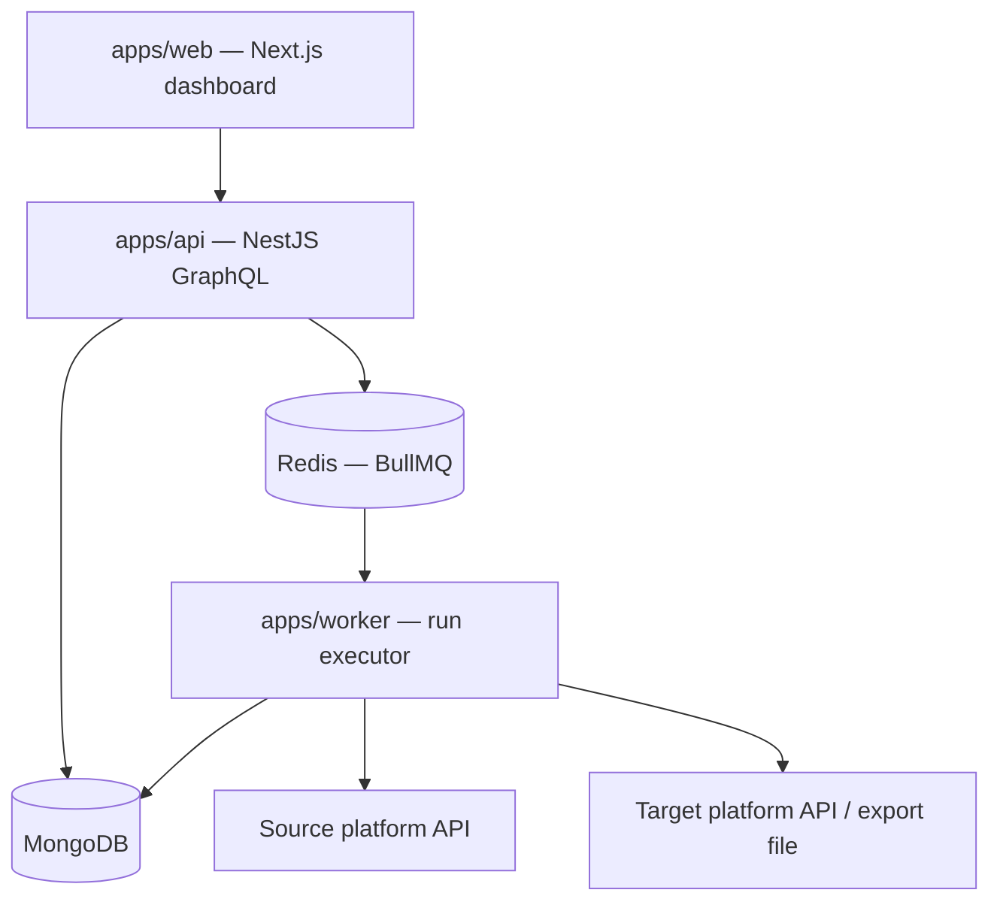

# System Overview

Commerce Data Orchestrator is a hosted tool for moving commerce catalog data between platforms (commercetools, Shopify, BigCommerce) or exporting it to a file.

See [migration-scope.md](./migration-scope.md) for the product boundary.

## Shape of the system

Three deployables and a small set of packages.

```mermaid
graph TD
    Web["apps/web — Next.js dashboard"] --> API["apps/api — NestJS GraphQL"]
    API --> Mongo[("MongoDB")]
    API --> Redis[("Redis — BullMQ")]
    Redis --> Worker["apps/worker — run executor"]
    Worker --> Mongo
    Worker --> Src["Source platform API"]
    Worker --> Tgt["Target platform API / export file"]
```

### Apps

| App | Responsibility |
|---|---|
| `apps/web` | Next.js App Router dashboard. Register/login, connections, projects, runs. Talks to the API over GraphQL (Apollo). |
| `apps/api` | NestJS code-first GraphQL. Auth, organizations, users, connections, projects, runs. Enqueues run jobs. Never touches connector code. |
| `apps/worker` | Single BullMQ consumer. Picks up a `MIGRATION_RUN` job, decrypts credentials, runs the pipeline per entity type, writes progress back to MongoDB. |

### Packages

| Package | Role | Depends on |
|---|---|---|
| `@cdo/shared` | Canonical types, Zod validators, enums, constants. Zero deps. | — |
| `@cdo/core` | Pure-TS pipeline: `EtlEngine` (extract → map → validate → load), bounded retry. No NestJS/Mongoose/BullMQ. | `@cdo/shared` |
| `@cdo/connectors` | commercetools / Shopify / BigCommerce source + target adapters, plus canonical mappers and normalizers. File-export target. | `@cdo/core`, `@cdo/shared` |
| `@cdo/db` | Mongoose schemas + org-scoped repositories. NestJS `@Global()` module. | `@cdo/shared` |
| `@cdo/queue` | BullMQ producer + Redis connection. | `@cdo/shared` |
| `@cdo/auth` | JWT strategy, guard, `@CurrentOrg()` decorator. | `@cdo/shared` |
| `@cdo/ui` | shadcn/ui components. | — |
| `@cdo/gql` | Apollo client wrapper + generated GraphQL hooks. | — |

> Removed vs the old design: `apps/worker-scrape`, `@cdo/ingestion`, `@cdo/mapping` (merged into `@cdo/connectors`), `@cdo/redis` (merged into `@cdo/queue`).

## Request → run flow

1. User creates a **MigrationProject** in the web UI: source connection + entity types + (`MIGRATE` → target connection | `EXPORT` → format).
2. User starts a **MigrationRun** (optionally `dryRun`). The API validates ownership, creates the run with one wave stub per entity type, and enqueues a `MIGRATION_RUN` BullMQ job keyed by run id.
3. The **worker** picks up the job:
   - Decrypts source (and target) credentials in memory.
   - For each entity type, in dependency order: stream batches from the source connector → map to canonical → Zod-validate → upsert into the target connector (or append to the export file). `dryRun` skips the write.
   - Records new target ids in `identity_maps` so later entities can resolve foreign keys (e.g. a product's categories).
   - Updates `migration_runs` progress counters and wave status; appends failures to `migration_runs.failedItems[]`.
4. On completion the run is `COMPLETED` (or `FAILED`). For exports, the file path/size is recorded and served via a download endpoint.

## Infra

- **MongoDB** — all persistent state.
- **Redis 7** — BullMQ only.
- **docker compose** brings up both for local dev.
