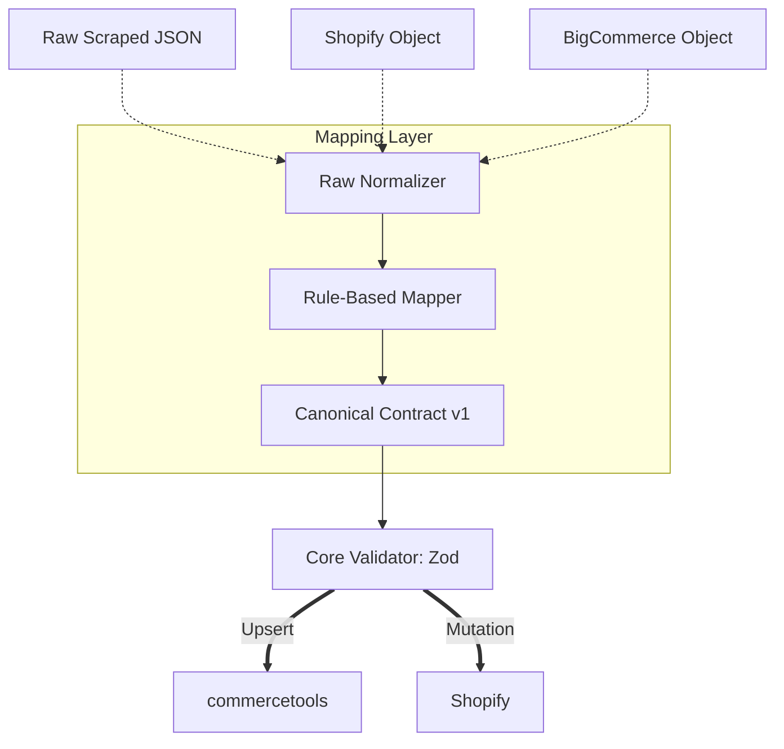

# Canonical Models

## Purpose
The Canonical Model is the ultimate "lingua franca" of the platform. It is a deterministic, unified interface designed to abstract away the quirks of individual platforms (e.g. Shopify's graph connections vs. Commercetools' masterVariants).

By utilizing a Canonical Model, any source system can talk to any target system simply by mapping its proprietary fields to the contract once.

## Canonical Transformation Flow

## Structure
All models exist in `@repo/shared` and follow a strict TypeScript interface coupled with runtime `Zod` validation schemas.

### 1. `CanonicalProduct`
- `id`: System unique identifier.
- `sku`: Master SKU.
- `name`: Map of string (Locale $\rightarrow$ value).
- `description`: Map of string html.
- `categories`: Array of Canonical Category IDs.
- `variants`: Array of Canonical Variants (combining Shopify variant options into structured attributes).

### 2. `CanonicalCategory`, `CanonicalCustomer`, `CanonicalOrder`
Defined using comparable agnostic structures covering B2C and B2B requirements globally.
