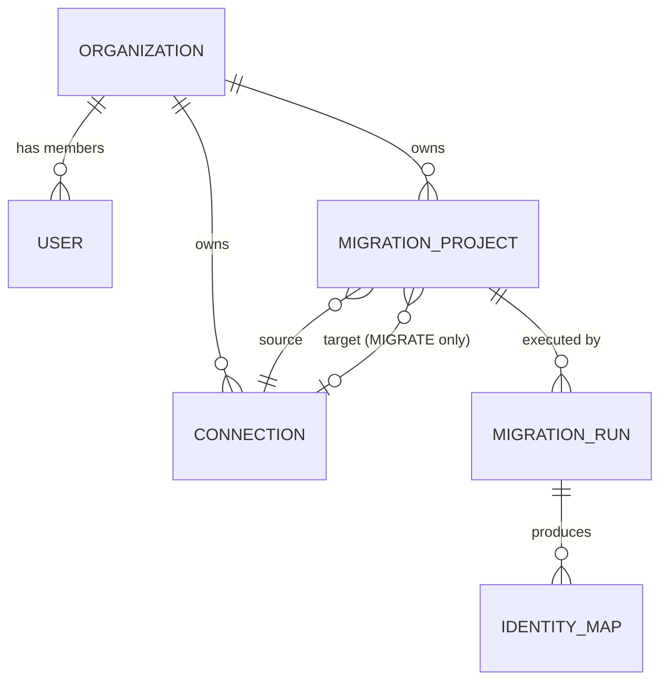

# Data Model

Six MongoDB collections. Every collection except `organizations` and `users` is scoped by `tenantId` (the organization id) and every repository method takes `tenantId` as its first argument.

## `organizations`

The customer account. Created during registration.

| Field | Type | Notes |
|---|---|---|
| `name` | string | Display name |
| `status` | `active` \| `suspended` | |
| `createdAt` / `updatedAt` | Date | |

## `users`

A person who signs in. Belongs to exactly one organization.

| Field | Type | Notes |
|---|---|---|
| `tenantId` | string (indexed) | Organization `_id` |
| `email` | string (unique) | Login identifier |
| `passwordHash` | string | bcrypt, cost 12 |
| `name` | string | |
| `role` | `OWNER` \| `MEMBER` | First user of an org is `OWNER`. Owners can invite members. |
| `status` | `active` \| `disabled` | |

**Registration** (`register` mutation) creates an `organization` + one `OWNER` `user` in a single operation.
**JWT payload**: `{ sub: userId, tenantId, role }`. `@CurrentOrg()` returns `{ userId, tenantId, role }`.

## `connections`

Platform credentials. (Schema file is currently `credential.schema.ts` / collection `credentials` — rename tracked in the simplification plan.)

| Field | Type | Notes |
|---|---|---|
| `tenantId` | string (indexed) | |
| `name` | string | User-chosen label |
| `platform` | `commercetools` \| `shopify` \| `bigcommerce` | |
| `encryptedData` | string | AES-256-GCM ciphertext of the credential JSON |
| `iv` / `authTag` | string | GCM parameters |
| `health` | `UNTESTED` \| `CONNECTED` \| `DISCONNECTED` \| `ERROR` | Set by the "test connection" action |
| `lastTestedAt` | Date | |

Credential JSON shape per platform:
- **commercetools**: `{ projectKey, clientId, clientSecret, authUrl?, apiUrl?, scopes? }`
- **shopify**: `{ shop, accessToken }` (or OAuth-issued token)
- **bigcommerce**: `{ storeHash, accessToken }`

Credentials are decrypted **only** in worker memory, never returned by the API.

## `migration_projects`

A reusable definition of "move this data from here to there".

| Field | Type | Notes |
|---|---|---|
| `tenantId` | string (indexed) | |
| `name` | string | |
| `mode` | `MIGRATE` \| `EXPORT` | |
| `sourceConnectionId` | string | Always required |
| `targetConnectionId` | string \| null | Required when `mode = MIGRATE`; must differ from source |
| `exportFormat` | `CSV` \| `JSON` \| null | Required when `mode = EXPORT` |
| `entityTypes` | `EntityType[]` | Non-empty subset of `CATEGORIES, PRODUCTS, CUSTOMERS, ORDERS` |
| `mappingConfig` | object | Optional per-field overrides; `{}` by default |
| `status` | `DRAFT` \| `ACTIVE` \| `ARCHIVED` | Archive = soft delete |

## `migration_runs`

One execution of a project.

| Field | Type | Notes |
|---|---|---|
| `tenantId` | string (indexed) | |
| `migrationProjectId` | string (indexed) | |
| `status` | `PENDING` \| `RUNNING` \| `COMPLETED` \| `FAILED` \| `CANCELLED` | |
| `dryRun` | boolean | Suppresses the target write / file output |
| `processedCount` / `failedCount` | number | Totals across waves |
| `waves` | `WaveRecord[]` | One per entity type, in dependency order |
| `failedItems` | `FailedItem[]` | Embedded — replaces the DLQ collection |
| `export` | `{ filePath, byteSize, format } \| null` | Set when an `EXPORT` run finishes |
| `startedAt` / `completedAt` | Date | |
| `errorSummary` | object | Populated on `FAILED` |
| `requestId` | string | Single tracing id, propagated to logs and the BullMQ job |

`WaveRecord`: `{ entityType, status (PENDING|RUNNING|COMPLETED|FAILED|SKIPPED), processedCount, failedCount, cursor?, startedAt?, completedAt? }`. `cursor` is an opaque source-pagination token used to resume.

`FailedItem`: `{ entityType, sourceId, reason, errorType (VALIDATION|TRANSIENT|FATAL), occurredAt }`.

## `identity_maps`

Links a source entity id to the id it received in the target, so downstream entities can resolve foreign keys (a product referencing its categories) and so re-runs are idempotent.

| Field | Type | Notes |
|---|---|---|
| `tenantId` | string (indexed) | |
| `migrationRunId` | string (indexed) | |
| `entityType` | `EntityType` | |
| `sourceId` | string | id in the source platform |
| `targetId` | string | id assigned by the target platform |

Compound index: `{ tenantId, entityType, sourceId }`.

Not used for `EXPORT` runs.

## Removed collections

`jobs`, `dlq_items`, `reconciliation_reports` are deleted. See [00-simplification-plan.md](../implementation-plans/00-simplification-plan.md).
