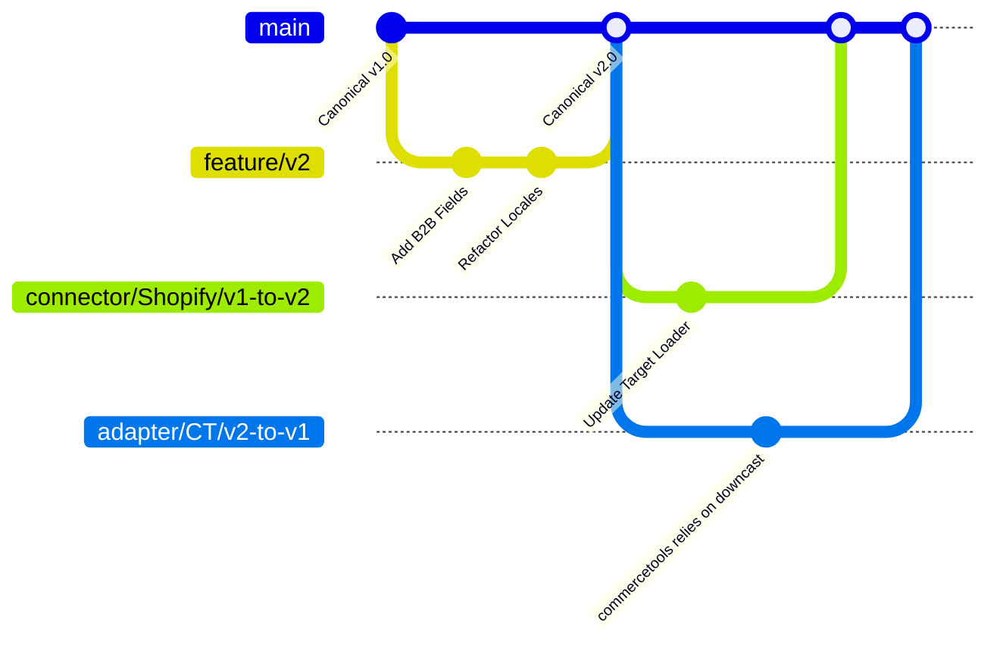

# Versioning Strategy

## Core Principles
The Canonical Contract `@repo/shared/models` acts as an internal API. As the platform supports new, exotic platforms (e.g., Salesforce Commerce Cloud), the contract must evolve.

Contracts are strictly versioned, starting with **Canonical Contract v1**.
- A `TargetConnector` natively advertises the version it expects.
- **Breaking changes** are never pushed into the wild; they are implemented as a new version (e.g. `v2`).
- **Backward Compatibility Note**: Older versions of the Canonical Contract remain explicitly supported by the mapping engine until all target platform connectors are upgraded to the latest version. Connectors are upgraded one-by-one.

## Connecting Adapters to New Versions
When the Canonical Model increments to `v2`:
1. The `CoreEngine` expects the `MappingLayer` to output `v2`.
2. Existing connectors still expecting `v1` utilize a **Downcast Adapter**.
3. We do not throw away old implementations until all platforms natively accept `v2`.

## Version Evolution Diagram

