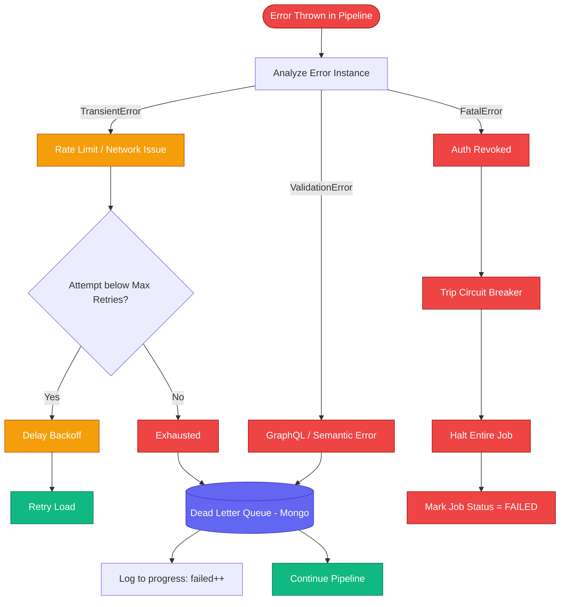

# Error Taxonomy

The platform strictly differentiates error types to ensure that millions of records can be processed without single toxic payloads destroying the overall job compute lifecycle.

## Classification

### 1. `ValidationError`
* **What**: The input Canonical Model failed Zod validation, or the target platform rejected the payload for explicit semantic reasons (e.g., "Missing tax category").
* **Action**: NO RETRY. Immediate push to Dead Letter Queue (DLQ). The worker moves on to the next entity.

### 2. `TransientError`
* **What**: Target API Rate limited, DNS resolution failed, Target Platform returned a 502 Bad Gateway.
* **Action**: EXPONENTIAL RETRY.

### 3. `FatalError`
* **What**: Target API keys revoked. Source API completely shut down. Disk out of space on Worker.
* **Action**: CIRCUIT BREAKER TRIPPED. Pause Job immediately. Do not attempt further records. Notify Tenant.

## Decision Flow Diagram

