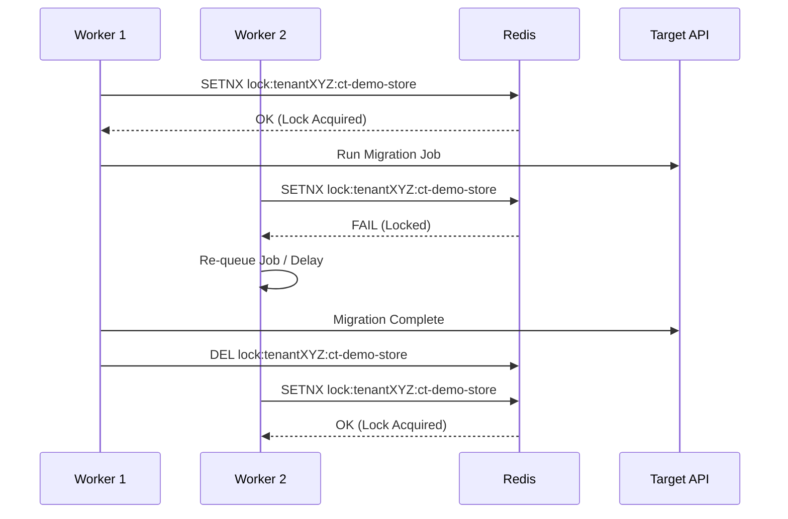

# Locking Strategy

Concurrency scales workers, but blindly scaling commerce mutations results in data corruption, race conditions, and catastrophic API rate limit blockages. We implement distributed target environment locking.

## Concept
A Target Environment (e.g. `commercetools_project_xyz` and its API URL) is locked during a migration job.
**Rule**: No two jobs can run mutative (Write) ETL operations simultaneously against the *exact same* Target Environment for a single Tenant.

### Soft vs Hard Locks
* **Hard Lock**: Entire target environment locked. Prevents `CROSS_PLATFORM_MIGRATION` and `PLATFORM_CLONE` from stumbling over each other.
* **Soft Lock**: Entity-specific locking. Prevents concurrent upserts on the exact same SKU (rare, relies on target idempotency).

## Redis-based Distributed Locking (Redlock)

