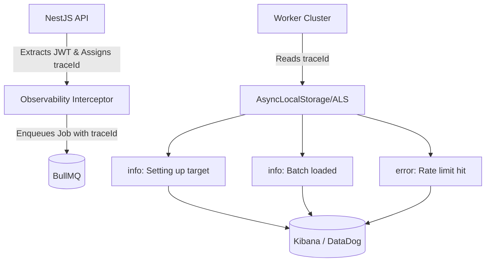

# Observability

## Strategy
Given the distributed nature of the async Worker clusters and API servers, log streams must be deterministic and fully correlated to rebuild the state of an ETL job if a Node pod crashes.

### Structured Logging
No `console.log()` strings are permitted. All output is handled through a NestJS global Pino/Winston logger emitting JSON lines `stdout`. E.g.:
```json
{"level":"info", "tenantId":"abc-123", "jobId":"1111", "msg":"Upserted 50 CanonicalProducts"}
```

### Correlation & Tracing
Every Job executed carries a `traceId`. Every GraphQL Operation executed carries a `correlationId`.

## Telemetry Execution


