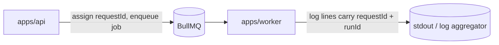

# Observability

## Structured logging

No `console.log`. All output goes through a global Pino logger emitting JSON lines to stdout:

```json
{"level":"info","tenantId":"org_abc","runId":"run_123","requestId":"req_xyz","msg":"Upserted 50 products"}
```

## One request id

Every GraphQL operation is assigned a single `requestId`. When the API enqueues a
`MIGRATION_RUN` job it puts `requestId` on the job payload; the worker reads it
back and includes it on every log line for that run, alongside `tenantId` and
`runId`. That is the whole tracing story — no separate `correlationId`/`traceId`
pair, no AsyncLocalStorage requirement, no OpenTelemetry exporter for the POC.


```mermaid
flowchart LR
    API["apps/api"] -->|"assign requestId, enqueue job"| Redis[("BullMQ")]
    Redis --> Worker["apps/worker"]
    Worker -->|"log lines carry requestId + runId"| Stdout[("stdout / log aggregator")]
```

## What to watch

- Run status and counters live on `migration_runs` — the dashboard reads them directly.
- A worker crash shows as a BullMQ job going `active → stalled`; it is re-delivered and the run resumes.
- Failed items are on `migration_runs.failedItems[]`, visible on the run detail page.
